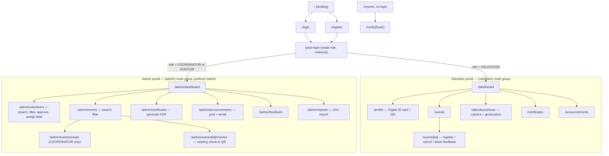
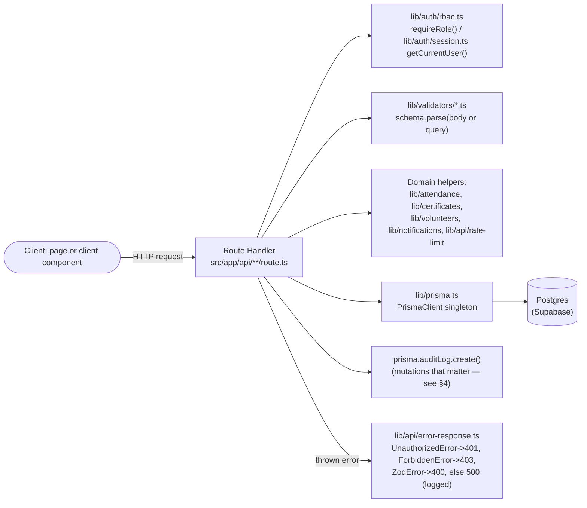
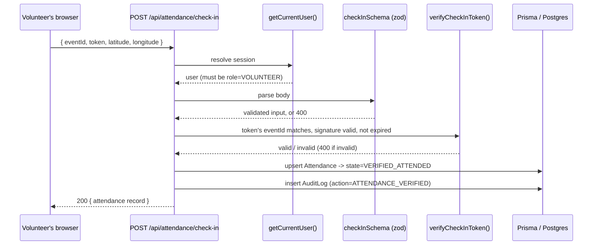
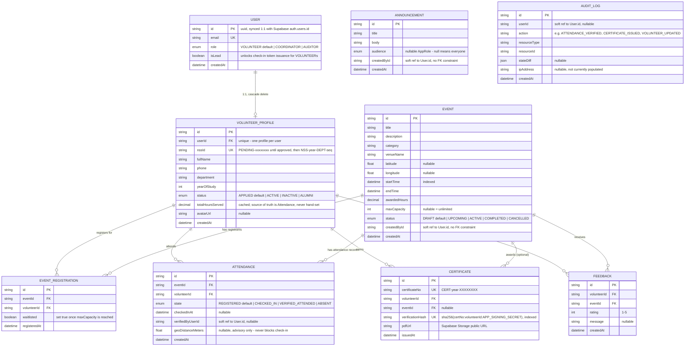

# NSS Connect — Architecture Reference

This is the up-to-date, diagram-first reference for how the codebase is actually laid out, as opposed to `PROJECT_CONTEXT.md`, which is the original plan (kept for history and open decisions). When the two disagree, this file and the code win — update this file in the same PR whenever the folder layout, an API route, or the Prisma schema changes.

Four things live here:

1. [Folder structure](#1-folder-structure) — what's on disk and why
2. [Frontend structure](#2-frontend-structure) — routes, role gating, navigation
3. [Backend structure](#3-backend-structure) — request lifecycle, layering
4. [Database schema](#4-database-schema) — tables, relationships, enums

A [module cross-reference](#5-module-cross-reference) at the end ties all three together per feature area.

---

## 1. Folder structure

```text
digitalmanagmentsys/
├── prisma/
│   ├── schema.prisma          # single source of truth for the DB shape — see §4
│   └── seed.ts                # creates one sample coordinator + volunteer
│
├── src/
│   ├── middleware.ts           # runs on every request; refreshes the Supabase
│   │                           # session cookie (does NOT enforce RBAC — see §3)
│   │
│   ├── app/
│   │   ├── layout.tsx, page.tsx, globals.css   # root shell + landing page
│   │   ├── post-login/          # redirect hub: sends VOLUNTEER -> /dashboard,
│   │   │                        # COORDINATOR|AUDITOR -> /admin/dashboard
│   │   │
│   │   ├── (public)/            # route group, no auth required
│   │   │   ├── login/
│   │   │   ├── register/
│   │   │   └── verify/[hash]/   # public certificate verification
│   │   │
│   │   ├── (volunteer)/         # route group, guarded by its layout.tsx
│   │   │   ├── layout.tsx       # redirects non-VOLUNTEER away
│   │   │   ├── dashboard/, profile/, events/, events/[id]/,
│   │   │   ├── attendance/scan/, certificates/, announcements/
│   │   │
│   │   ├── (admin)/             # route group, guarded by its layout.tsx
│   │   │   ├── layout.tsx       # redirects anyone but COORDINATOR|AUDITOR away
│   │   │   └── admin/           # <- real URL prefix; see §2 for why
│   │   │       ├── dashboard/, volunteers/, events/, events/create/,
│   │   │       ├── events/[id]/monitor/, certificates/, announcements/,
│   │   │       ├── feedback/, reports/
│   │   │
│   │   └── api/                 # route handlers — see §3
│   │       ├── volunteers/, volunteers/[id]/
│   │       ├── events/, events/[id]/, events/[id]/register/, events/[id]/token/
│   │       ├── attendance/check-in/
│   │       ├── certificates/generate/, certificates/verify/[hash]/
│   │       ├── announcements/
│   │       ├── feedback/
│   │       └── reports/export/
│   │
│   ├── components/
│   │   ├── ui/                  # hand-built shadcn/ui primitives (Button, Card, Input, Label)
│   │   └── shared/               # cross-page pieces, e.g. Pager
│   │
│   └── lib/                     # framework-free domain logic — see §3
│       ├── prisma.ts             # the one PrismaClient singleton
│       ├── utils.ts               # cn() class-merge helper
│       ├── supabase/             # client.ts (browser), server.ts (RSC),
│       │                         # middleware.ts (session refresh), admin.ts (service role)
│       ├── auth/                 # session.ts (getCurrentUser), rbac.ts (requireRole)
│       ├── validators/           # one zod schema file per module
│       ├── attendance/           # token.ts (signed check-in token), geo.ts (Haversine)
│       ├── certificates/         # generate.ts (pdf-lib), hash.ts (verification hash)
│       ├── volunteers/           # nss-id.ts (NSS ID assignment)
│       ├── notifications/        # email.ts (Resend, best-effort)
│       └── api/                  # error-response.ts, rate-limit.ts
│
├── tests/
│   ├── unit/                    # Vitest — pure logic, mocked-Prisma route tests,
│   │                            # component tests (see §3 and §5 for what's covered)
│   └── e2e/                     # Playwright — needs a live app + DB to run
│
├── docs/
│   ├── PROJECT_CONTEXT.md       # original plan + open decisions (history)
│   └── ARCHITECTURE.md          # this file
│
└── .env.example                 # every env var the app needs, documented
```

**Why route groups split into three, but only two actually gate:** `(public)`, `(volunteer)`, `(admin)` are Next.js route groups — folders in parentheses that organize files without adding a URL segment. Only `(volunteer)/layout.tsx` and `(admin)/layout.tsx` do anything at runtime (redirect based on role); `(public)` is just for organization.

**Why `(admin)/admin/...` and not `(admin)/...`:** the original plan had `(volunteer)/dashboard/page.tsx` and `(admin)/dashboard/page.tsx` side by side — both would resolve to the same URL `/dashboard`, which Next.js rejects at build time. Prefixing the admin group's real folder with `admin/` (`(admin)/admin/dashboard/page.tsx` → `/admin/dashboard`) is the fix; `(volunteer)` didn't need it since it owns the top-level paths.

---

## 2. Frontend structure



**How pages get their data.** Every page above is a Server Component that queries Prisma directly (`import { prisma } from "@/lib/prisma"`) — it does not fetch its own API route. The `api/**` routes exist for client-side mutations (button clicks: register, cancel, approve, generate certificate, ...) and for any future non-browser client. This is a deliberate, consistent choice: don't self-fetch inside the same Next.js app.

**Role gating happens twice, on purpose:**
- **UI-level** (`(volunteer)/layout.tsx`, `(admin)/layout.tsx`): redirects the wrong role away before a page even renders. This is a UX nicety.
- **API-level** (`requireRole()` in every mutating route handler, §3): the actual enforcement. An AUDITOR who somehow lands on `/admin/events/create` and submits the form still gets a 403 from `POST /api/events` — the UI redirect is not the security boundary.

**Client components** are the exceptions to "Server Component queries Prisma": anything interactive (`RegisterButton`, `FeedbackForm`, `CreateEventForm`, `GenerateCertificateForm`, `VolunteerRosterTable`'s row actions, `LiveTokenProjector`) is a `"use client"` component that calls `fetch()` against the `api/**` routes, then calls `router.refresh()` to re-run the parent Server Component's Prisma query and show the new state.

---

## 3. Backend structure



**The pattern every route handler follows**, in order:
1. Resolve the session (`getCurrentUser()`) and, for anything that isn't a plain read, gate it (`requireRole([...])` or a manual role check for cases `requireRole` doesn't cover, like "only the volunteer who owns this registration").
2. Validate the request body/query with the matching Zod schema from `lib/validators/`. A `ZodError` is caught by `toErrorResponse()` and turned into a 400 automatically — handlers never hand-roll this.
3. Run the actual logic, usually a `prisma.$transaction(...)` when more than one write must succeed or fail together (event registration capacity check + create, attendance upsert, volunteer approval + NSS ID assignment).
4. Write an `AuditLog` row for anything the append-only trail is supposed to cover (attendance verification, certificate issuance, volunteer/event admin edits).
5. Return a typed JSON response, or let a thrown error fall through to `toErrorResponse()`.

**Worked example — attendance check-in**, the route that touches the most pieces at once:



The check-in token itself (`lib/attendance/token.ts`) is a signed, ~30-second-lived string of the form `eventId.expiresAt.signature`, HMAC-signed with `APP_SIGNING_SECRET`. The admin's live monitor page (`/admin/events/[id]/monitor`) polls `GET /api/events/[id]/token` every 25s and renders the result as a QR code; a volunteer's camera reads the QR, and the scan page extracts `eventId` from the token's own first segment before posting to check-in — the server independently re-verifies that segment against the signature, so a tampered `eventId` is simply rejected, never trusted from the client.

**Rate limiting** (`lib/api/rate-limit.ts`) only guards the one route that takes no authentication at all: `GET /api/certificates/verify/[hash]`, at 20 requests/minute per IP. It's an in-memory fixed-window counter — good enough for one instance, documented as the thing to swap for Redis (`PROJECT_CONTEXT.md` §3.2) if traffic ever justifies it.

**Testing without a database.** Route handlers are plain async functions exported from `route.ts` files, so `tests/unit/api/*.test.ts` imports them directly and calls them with a real `Request`/`NextRequest`, after replacing `@/lib/prisma` and `@/lib/auth/session` with `vi.mock(...)` doubles. This validates RBAC, validation, and business logic (capacity/waitlist math, pagination math) without touching Postgres — see `tests/unit/api/events-register.test.ts` and `tests/unit/api/volunteers-list.test.ts` for the pattern to copy for new routes.

---

## 4. Database schema



**Uniqueness constraints double as concurrency guards, not just data integrity:**
- `EventRegistration.@@unique([eventId, volunteerId])` — a volunteer can't register for the same event twice; a race between two simultaneous register clicks resolves to one row + one `P2002` error the route maps to `409 Conflict`.
- `Attendance.@@unique([eventId, volunteerId])` — the same guard for check-in; a second scan just `upsert`s the same row rather than creating a duplicate.
- `Feedback.@@unique([eventId, volunteerId])` — one review per volunteer per event.
- `VolunteerProfile.nssId` / `Certificate.certificateNo` / `Certificate.verificationHash` are all `@unique` — collisions on ID/hash generation surface as a `409` telling the caller to retry, rather than silently overwriting.

**`totalHoursServed` is a trap for future edits:** it's a cached column, but every read path that reports hours (`/dashboard`, `/api/reports/export`) recomputes the sum live from `Attendance` rows where `state = VERIFIED_ATTENDED`, joined to `Event.awardedHours` — it does not trust the cached column. Don't add a write path that increments `totalHoursServed` directly; if you need it to actually stay in sync, that's a deliberate follow-up, not an accident to introduce.

**Fields named `...ById` or `verifiedByUserId` are soft references** — plain `String` columns holding a `User.id` value, not Prisma relations with an enforced foreign key. This was a scaffolding shortcut; tightening them into real relations (at the cost of a migration) is fair game for a later pass if referential integrity there turns out to matter.

---

## 5. Module cross-reference

Ties the ten required modules (per `PROJECT_CONTEXT.md` §1/§7) to what actually implements each one today.

| Module | Frontend | API | Database |
| :--- | :--- | :--- | :--- |
| 1. Dashboard | `/dashboard`, `/admin/dashboard` | reads only, direct Prisma | `Attendance`, `Event`, `VolunteerProfile` |
| 2. Volunteer Management | `/register`, `/profile`, `/admin/volunteers` | `POST /api/volunteers`, `GET/PATCH /api/volunteers/[id]`, `GET /api/volunteers` (paginated/filterable) | `User`, `VolunteerProfile` |
| 3. Event Management | `/events`, `/events/[id]`, `/admin/events`, `/admin/events/create` | `GET/POST /api/events` (paginated/filterable), `GET/PATCH /api/events/[id]`, `POST/DELETE /api/events/[id]/register` | `Event`, `EventRegistration` |
| 4. Attendance Management | `/attendance/scan`, `/admin/events/[id]/monitor` | `GET /api/events/[id]/token`, `POST /api/attendance/check-in` | `Attendance` |
| 5. Achievements & Performance | `/dashboard` stats, `/admin/dashboard` | derived query (no dedicated route) | `Attendance` joined to `Event.awardedHours` |
| 6. Certificates | `/certificates`, `/admin/certificates`, `/verify/[hash]` | `POST /api/certificates/generate`, `GET /api/certificates/verify/[hash]` (rate-limited) | `Certificate` |
| 7. Communication | `/announcements`, `/admin/announcements`, feedback form on `/events/[id]`, `/admin/feedback` | `GET/POST /api/announcements` (+ best-effort Resend email), `GET/POST /api/feedback` | `Announcement`, `Feedback` |
| 8. Officer/Admin Management | every `(admin)/admin/*` page | every route gated by `requireRole(["COORDINATOR", ...])`; AUDITOR gets read-only | n/a — cross-cutting via `lib/auth/rbac.ts` |
| 9. NSS Activity & Impact | `/admin/dashboard`, `/admin/reports` | `GET /api/reports/export` (CSV) | aggregates across `VolunteerProfile`, `Event`, `Attendance` |
| 10. Profile & Digital ID | `/profile` (QR via `qrcode`) | reuses volunteer profile data, no dedicated route | `VolunteerProfile` |

`AuditLog` isn't in the table above because it's not user-facing — it's written by modules 4 (attendance verification), 6 (certificate issuance), 2 (volunteer approval/lead toggle), and 3 (event edits), per the guardrail in `PROJECT_CONTEXT.md` §8.
